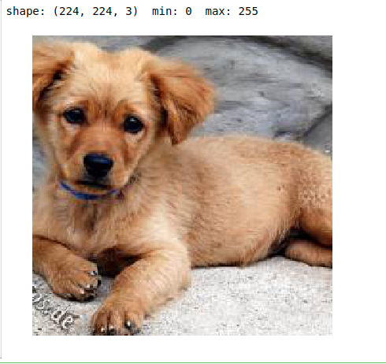
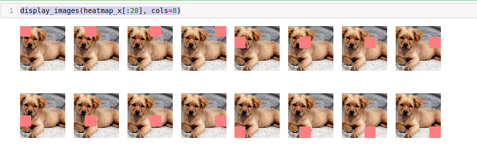
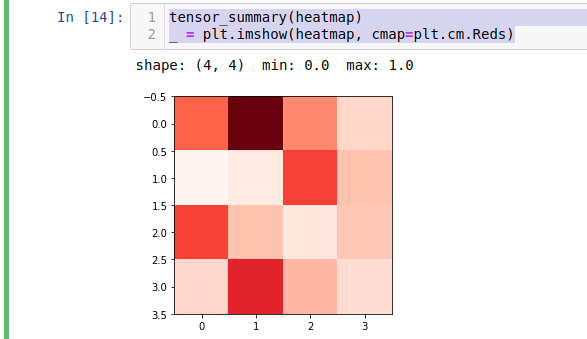
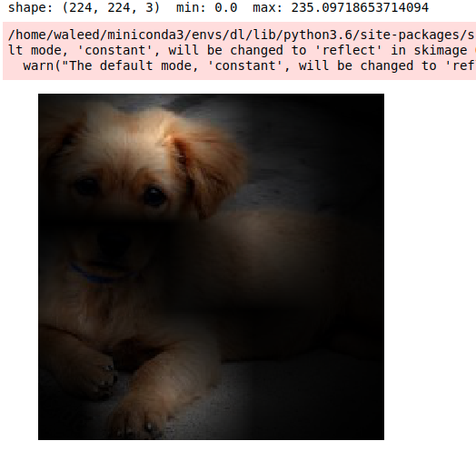
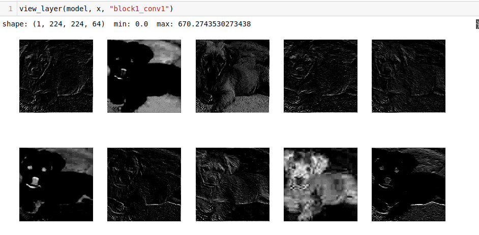
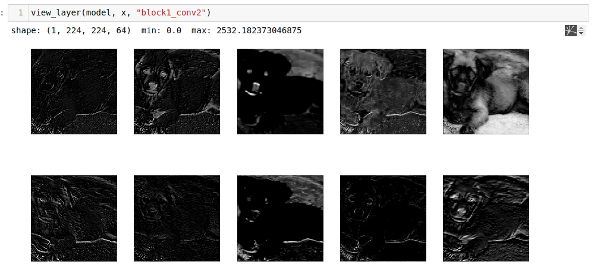
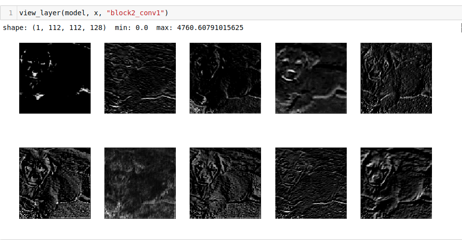
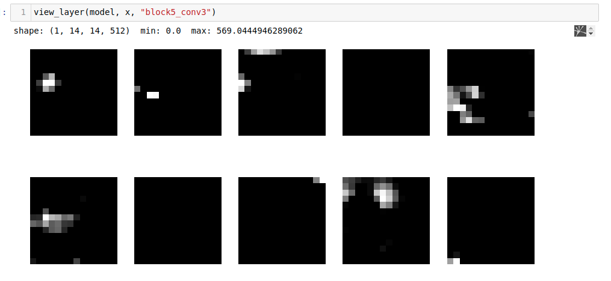

## Visualizing How Convolutional Neural Networks See

In this article we are going to see how a convolutional neural network learns different objects or how a convolutional neural networks see. So lets start

## Lets setup a jupyter notebook
I am going to use jupyter notebook for this so that we can see/debug everything single of code. Its preety simple and amazing.

## Installation required
Open your linux or mac terminal
Create a conda environment
```
conda create -n CNN_eye python=3.8
# Activate the environment
conda activate CNN_eye
```
Use your conda environment in jupyter through ipykernel
```
pip install ipykernel
python -m ipykernel install --user --name CNN_eye
pip install -r requirements.txt
```

Open your jupyter notebook
```
# If you dont have jupyter notebook please install it first
jupyter notebook
```

### Tada Installations is done

## Code dive
We are going to use image-net pretrained model and predict a dog from it, and then we will see on which parts tensorflow keras focus the most to make a prediction. 

### 1. Importing all of the required packages
```
import math
import numpy as np
import tensorflow as tf
import matplotlib.pyplot as plt
import skimage.io
import skimage.transform
import skimage.filters
import keras
from keras.applications import vgg16
from keras import backend as K

# Allow graph embeding in notebook
%matplotlib inline
```
### 2. Helper functions

```python
def tensor_summary(tensor):
    """Display shape, min, and max values of a tensor."""
    print("shape: {}  min: {}  max: {}".format(tensor.shape, tensor.min(), tensor.max()))

    
def normalize(image):
    """Takes a tensor of 3 dimensions (height, width, colors) and normalizes it's values
    to be between 0 and 1 so it's suitable for displaying as an image."""
    image = image.astype(np.float32)
    return (image - image.min()) / (image.max() - image.min() + 1e-5)


def display_images(images, titles=None, cols=5, interpolation=None, cmap="Greys_r"):
    """
    images: A list of images. I can be either:
        - A list of Numpy arrays. Each array represents an image.
        - A list of lists of Numpy arrays. In this case, the images in
          the inner lists are concatentated to make one image.
    """
    titles = titles or [""] * len(images)
    rows = math.ceil(len(images) / cols)
    height_ratio = 1.2 * (rows/cols) * (0.5 if type(images[0]) is not np.ndarray else 1)
    plt.figure(figsize=(15, 15 * height_ratio))
    i = 1
    for image, title in zip(images, titles):
        plt.subplot(rows, cols, i)
        plt.axis("off")
        # Is image a list? If so, merge them into one image.
        if type(image) is not np.ndarray:
            image = [normalize(g) for g in image]
            image = np.concatenate(image, axis=1)
        else:
            image = normalize(image)
        plt.title(title, fontsize=9)
        plt.imshow(image, cmap=cmap, interpolation=interpolation)
        i += 1

```

### 3. Buld a VGG neural Network

```python
# Build a VGG16 Convolutional Network pre-trained on ImageNet
model = vgg16.VGG16(weights='imagenet')
model.summary()
```
So here is our convolutional neural network which we are going to visualize
```
_________________________________________________________________
Layer (type)                 Output Shape              Param #   
=================================================================
input_1 (InputLayer)         (None, 224, 224, 3)       0         
_________________________________________________________________
block1_conv1 (Conv2D)        (None, 224, 224, 64)      1792      
_________________________________________________________________
block1_conv2 (Conv2D)        (None, 224, 224, 64)      36928     
_________________________________________________________________
block1_pool (MaxPooling2D)   (None, 112, 112, 64)      0         
_________________________________________________________________
block2_conv1 (Conv2D)        (None, 112, 112, 128)     73856     
_________________________________________________________________
block2_conv2 (Conv2D)        (None, 112, 112, 128)     147584    
_________________________________________________________________
block2_pool (MaxPooling2D)   (None, 56, 56, 128)       0         
_________________________________________________________________
block3_conv1 (Conv2D)        (None, 56, 56, 256)       295168    
_________________________________________________________________
block3_conv2 (Conv2D)        (None, 56, 56, 256)       590080    
_________________________________________________________________
block3_conv3 (Conv2D)        (None, 56, 56, 256)       590080    
_________________________________________________________________
block3_pool (MaxPooling2D)   (None, 28, 28, 256)       0         
_________________________________________________________________
block4_conv1 (Conv2D)        (None, 28, 28, 512)       1180160   
_________________________________________________________________
block4_conv2 (Conv2D)        (None, 28, 28, 512)       2359808   
_________________________________________________________________
block4_conv3 (Conv2D)        (None, 28, 28, 512)       2359808   
_________________________________________________________________
block4_pool (MaxPooling2D)   (None, 14, 14, 512)       0         
_________________________________________________________________
block5_conv1 (Conv2D)        (None, 14, 14, 512)       2359808   
_________________________________________________________________
block5_conv2 (Conv2D)        (None, 14, 14, 512)       2359808   
_________________________________________________________________
block5_conv3 (Conv2D)        (None, 14, 14, 512)       2359808   
_________________________________________________________________
block5_pool (MaxPooling2D)   (None, 7, 7, 512)         0         
_________________________________________________________________
flatten (Flatten)            (None, 25088)             0         
_________________________________________________________________
fc1 (Dense)                  (None, 4096)              102764544 
_________________________________________________________________
fc2 (Dense)                  (None, 4096)              16781312  
_________________________________________________________________
predictions (Dense)          (None, 1000)              4097000   
=================================================================
Total params: 138,357,544
Trainable params: 138,357,544
Non-trainable params: 0
_________________________________________________________________

```

### 4. Picking a random image from google

```
# Pick a random image from the Web.
# Make sure it's 224x224 image since VGG16 expects this size.
image = skimage.io.imread("http://lorempixel.com/224/224/animals/")
assert image.shape == (224, 224, 3), "Must be 224x224 RGB Image"
tensor_summary(image)
display_images([image], cols=2)
```


### 5. Pass it through the neural Network

```python
# Convert image to float
x = image.astype(np.float32)
# Make it a batch of one. The model expects a batch, not a single image
x = x[np.newaxis,...]
# Preprocess image. Convert RGB to BGR and subtract the ImageNet mean.
x = vgg16.preprocess_input(x)
# Classify the image
predictions = model.predict(x)
# We'll get a 1000 values. Print the first 10.
print(predictions[0][:10])
```
After passing it through the neural network we will got some predictions

```
[9.3140699e-08 9.0269637e-08 9.5612025e-09 8.4364444e-09 4.5000057e-08
 1.7079135e-06 6.9011213e-07 2.3229484e-06 1.8740766e-05 1.9108988e-07]
```
Lets get the index of our prediction value
```
# Find the largest confidence value. This corresponds to the label index.
label_index = np.argmax(predictions)
print("label index: ", label_index)
# Display the top 5 classes
vgg16.decode_predictions(predictions)
```
So these are the predictions
```
[[('n02099601', 'golden_retriever', 0.77799094),
  ('n02099712', 'Labrador_retriever', 0.030764945),
  ('n04409515', 'tennis_ball', 0.024390444),
  ('n02100877', 'Irish_setter', 0.022262523),
  ('n02094114', 'Norfolk_terrier', 0.019325975)]]
```

### 6. Lets see the Heatmaps of Convolutional Neural Network :D

Its shows that how neural network read the image in blocks
```
step = 56
heatmap_x = []
for row in range(0, image.shape[0], step):
    for col in range(0, image.shape[1], step):
        new_image = image.copy()
        # Add a square patch. Using a bright color here to make it easier to see.
        new_image[row:row+step, col:col+step, :] = [250,128,128]
        heatmap_x.append(new_image)
heatmap_x = np.stack(heatmap_x)
heatmap_x.shape
display_images(heatmap_x[:28], cols=8)
```


Now we are going to pass all of the patches to our neural network model

```python
heatmap_y = model.predict(vgg16.preprocess_input(heatmap_x.astype(np.float32)))
tensor_summary(heatmap_y)
```
Visualising heatmap we got from neural network
```
tensor_summary(heatmap)
_ = plt.imshow(heatmap, cmap=plt.cm.Reds)
```


So we got these patches, Lets merge the original image and the patch image

```python
def apply_mask(image, mask):
    # Resize mask to match image size
    mask = skimage.transform.resize(normalize(mask), image.shape[:2])[:,:,np.newaxis].copy()
    # Apply mask to image
    image_heatmap = image * mask
    tensor_summary(image_heatmap)
    display_images([image_heatmap], cols=2)


# Apply mask to image
apply_mask(image, heatmap**2)
```


So you can clearly in this image, that on which part our convolutional nerual network focus the most.
Lets visualsize the layers and activations

```python
def read_layer(model, x, layer_name):
    """Return the activation values for the specifid layer"""
    # Create Keras function to read the output of a specific layer
    get_layer_output = K.function([model.layers[0].input], [model.get_layer(layer_name).output])
    outputs = get_layer_output([x])[0]
    tensor_summary(outputs)
    return outputs[0]
    
def view_layer(model, x, layer_name, cols=5):
    outputs = read_layer(model, x, layer_name)
    display_images([outputs[:,:,i] for i in range(10)], cols=cols)
```






In the last convolution you can easily see the focus part of the images.

So how was the article, Is it helpful ? You can see more visualisation stuff on my github, 


## Contact Details
* Sohaib Anwaar
* gmail          : sohaibanwaar36@gmail.com
* linkedin       : [Have Some Professional Talk here](https://www.linkedin.com/in/sohaib-anwaar-4b7ba1187/)
* Stack Overflow : [Get my help Here](https://stackoverflow.com/users/7959545/sohaib-anwaar)
* Kaggle         : [View my master-pieces here](https://www.kaggle.com/sohaibanwaar1203)
* Github         : https://github.com/SohaibAnwaar/cnn-visualization